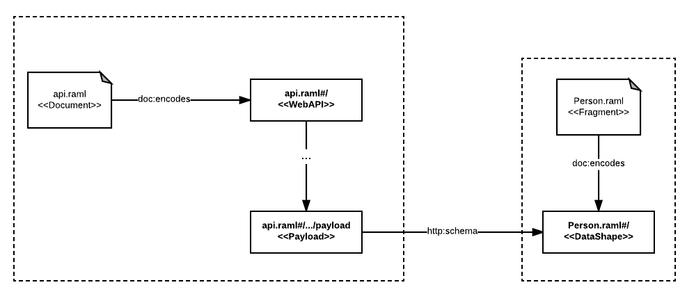
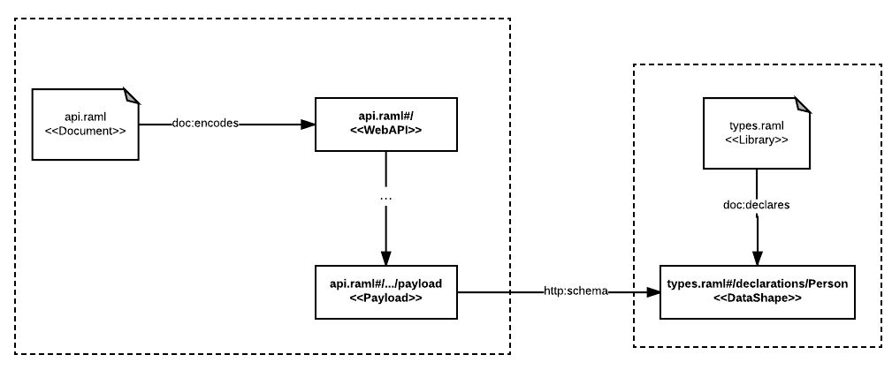

# Types of RAML Documents

RAML documents can introduce information in two different ways depending on how the URI identifying the information is generated:

- Information can be **encoded**:  In this case the URL of the document is the URI identifying the graph of information in the document that can be linked from other RAML documents
- Information can be **declared**: In this case, a particular URI for each declared entity in the graph, different from the URL of the document  will be generated by AMF and it can be referred from other RAML documents to link to those entities.


These two types of introducing information in document differentiates the different types of RAML documents that can be published using AMF:

- **RAML Fragments**: is reusable description of a particular entity that is encoded in a RAML document and is meant to be reused in other documents
- **RAML Libraries**: collections of declared entities with their own URIs identifying them that can be referred in other RAML documents
- **RAML Documents**: stand-alone information description that are encoded in a RAML document but can also declare some additional auxiliary entities that can be referred from the main entity encoded in the document.

The following table summarizes the three different types of documents:

| Type | Can encode | Can declare |
|------|------------|-------------|
| RAML Fragment | Yes (public) | No |
| RAML Library | No | Yes (public) |
| RAML Document | Yes (public) | Yes (private) |


Different types of documents use different RAML dialect declarations and are backed by the RAML syntax to introduce links and references to each other.

## Links to encoded documents

Information encoded in RAML Fragments can be linked using the `!include` RAML syntax tag.

In the following example we define the data shape for a person payload encoded in the RAML Fragment `Person.raml`:

``` yaml
#%RAML 1.0 DataType

type: object
properties:
  name: string
  surname: string
  age: number
```

Then we can link this data type fragment from a RAML Document encoding a web API specification encoded in the `api.raml` RAML Document:

``` yaml
#%RAML 1.0

title: test with includes
version: 1.0

/people:
  get:
    responses:
      200:
        body:
          application/json:
           !include Person.raml
```

When these documents are processed by AMF, a graph including a link from the API payload linking to the data shape encoded in the fragment will be generated as showed in the following diagram:




## Referencing declared entities

Information declared in RAML Libraries can be referenced in other RAML documents through the `use` RAML syntax keyword.

In the following example we define the same Person data shape but we declare it inside the `types.raml`  RAML Library:


``` yaml
#%RAML 1.0 Library

types:

  Person:
    type: object
    properties:
      name: string
      surname: string
      age: number
```

The `Person` declared will have its own URI when parsed by AMF `types.raml#declarations/Person`. It can be referenced from a web API specification encoded in the `api.raml` RAML Document in the following way:

``` yaml
#RAML 1.0

title: test with includes
version: 1.0

uses:
  types: types.raml

/people:
  get:
    responses:
      200:
        body:
          application/json:
            types.Person
```

AMF will generate the following graph when processing both documents, including a link to the URI of the Person data shape:




## Auxiliary RAML Documents

Additionally to RAML Documents, Fragments and Libraries there are some more RAML Documents that are supported by AMF with auxiliary functions beyond information description:

- **RAML Vocabularies**: Documents used to declare shared terms that can be used in RAML documents
- **RAML Dialects**: Definition of the structure of new types of RAML documents
- **RAML Extensions and Overlays**: Information description that can be used to customise and adapt aspects of another RAML Document

We will cover these auxiliary documents in the following chapters of this book.
