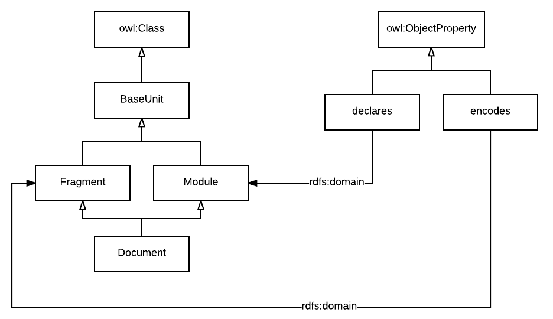

# RAML Vocabularies

Before describing any kind of information domain, the first thing that is required is a vocabulary to designate the entities in that information domain.

RAML Vocabularies is the mechanism introduced by AMF to describe the entities in any information domain and define formally certain relationships between those vocabulary terms.
The outcome of this process is a document that contains a model of the knowledge in that information domain that can be used to provide the meaning of the data published as RAML documents.
The main goal of RAML Vocabularies is to provide a declarative mechanism to discuss and agree the meaning of the information about a particular portion of reality that is going to be published as data in a way that can be shared by people in a team or organization and processed automatically by machines.

## RAML Vocabularies syntax

The complete description of the syntax and semantics of RAML Vocabularies can be found in the [RAML Vocabularies documentation](https://github.com/mulesoft/amf/blob/master/documentation/raml_vocabularies.md).

At its core, a RAML Vocabulary is just a plain list of `class terms` defining types of entities and `property terms` defining relationships between types of entities or entities properties.
Textual descriptions of the meaning of each type of term can be provided and can be used as documentation.
Formally, both types of terms can `extend` other terms following subset semantics and properties can have a `domain` and a `range`. Property term ranges can be a class term, if the property defines a relationship between types of entities or a scalar type if the property term is just a data property for entities.

The following example is a subset of the [RAML Vocabulary used by AMF describing the types of RAML documents](https://github.com/mulesoft/amf/blob/master/vocabularies/vocabularies/raml_doc.raml) introduced in the [previous chapter of this book](../documents/types.md):

``` yaml
#%RAML 1.0 Vocabulary

base: "http://raml.org/vocabularies/document#"

usage: |
  Document Model vocabulary for AMF. The Document Model defines the basic
  modular units where domain descriptions can be encoded.

classTerms:

  BaseUnit:
    displayName: Base Unit
    description: |
      Base class for every single document model unit. After parsing
      a document the parser generate parsing Units.
      Units encode the domain elements and can reference other units
      to re-use descriptions.

  Document:
    displayName: Document
    description: |
      A Document is a parsing Unit that encodes a stand-alone DomainElement
      and can include references to other DomainElements that reference from
      the encoded DomainElement.
      Since it encodes a DomainElement, but also declares references, it behaves
      like a Fragment and a Module at the same time.
      The main difference is that the Document encoded DomainElement is
      stand-alone and that the references declared are supposed to be private not
      for re-use from other Units
    extends: [Fragment, Module]

  Module:
    displayName: Library
    description: |
      A Module is a parsing Unit that declares DomainElements that can be
      referenced from the DomainElements in other parsing Units.
      It main purpose is to expose the declared references so they can be re-used.
    extends: BaseUnit
    properties:
      - declares

  Fragment:
    displayName: Fragment
    description: A Fragment is a parsing Unit that encodes a DomainElement
    extends: BaseUnit
    properties:
      - encodes

  DomainElement:
    displayName: Domain Element
    description: |
      Base class for any element describing a domain model.
      Domain Elements are encoded into fragments


propertyTerms:

  encodes:
    displayName: encodes
    description: |
      The encodes relationship links a parsing Unit with the
      DomainElement from a particular domain the unit contains.
    range: DomainElement

  declares:
    displayName: declares
    description: |
      The declares relationship exposes a DomainElement as a re-usable unit
      that can be referenced from other units.
      URIs for the declared DomainElement are considered to be stable and
      safe to reference from other DomainElements.
    range: DomainElement
```

As you can see, a hierarchy of class terms and property terms with their domain and ranges are asserted in this vocabulary as shown in the following diagram:




## RAML Vocabularies semantics

RAML Vocabularies are formal descriptions of the information of a particular domain. By formal we mean that it has a precise semantics described using a mathematical foundation. We are using a very small subset of the official W3C Recommendation [OWL2](https://www.w3.org/TR/owl2-overview/) to provide the logical foundation for RAML Vocabularies.

One important notion in the design of a RAML Vocabulary is that, following OWL2 semantics, they follow the **open-world assumption**. A RAML Vocabulary is not a schema that can be used to validate the integrity of data (RAML Dialects can be used for that) but assumes that the information is going to be incomplete and can be used to infer new knowledge algorithmically (for instance using a compliant OWL2 reasoner).


## Linking vocabularies

RAML Vocabulary documents can refer to terms described in other documents using them as RAML Libraries containing declarations of terms.
Additionally, `external vocabularies` like [Schema.org](http://schema.org/) can be used inside a RAML vocabulary using the `external` keyword. The only condition is to associate a URI prefix to the vocabulary to generate the URIs identifying the entities in that vocabulary.

## Parsing vocabularies

AMF can parse RAML Vocabularies and generate an output data graph as with any other RAML document.
Every term in the vocabulary will be parsed generating a unique URI for it. The `base` keyword must be used to provide a prefix for the terms in the vocabulary.
